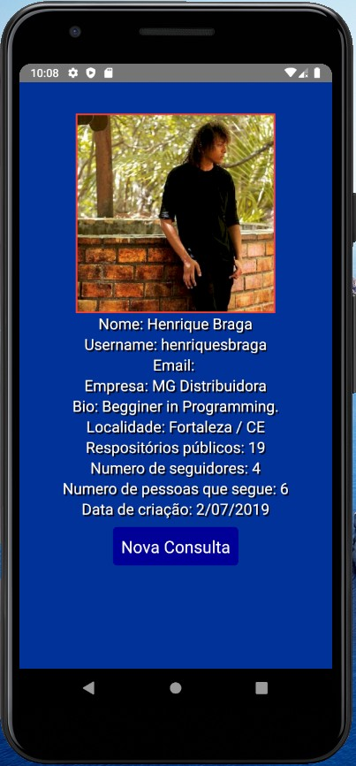

Um aplicativo para pesquisar dados de um usuário do github

Criei esse aplicativo para exercitar e aprender ainda mais React Native.
Separei as paginas por arquivos .js, separei a folha de estilo em um arquivo separado e usei o Stack Navigator para a navegação.

 
